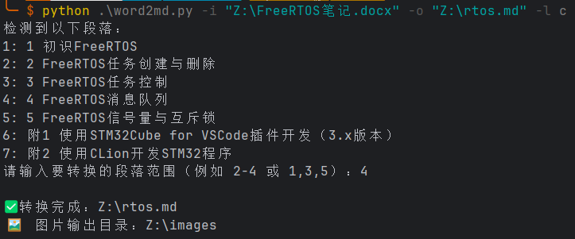

# 📝 word2md - 一键将 Word 转换为 Markdown！

🚀 **word2md** 是一个强大且易用的python工具，能够将 `.docx` 格式的 Word 文档转换为结构清晰、图片可视、格式友好的 **Markdown 文档**，非常适合技术文档、项目报告、博客发布等场景！

---

## ✨ 功能亮点

✅ **支持按段落选择性导出**  
✅ **自动提取并嵌入 Word 中的图片**（以 Markdown 格式引用）  
✅ **保留标题层级结构**（支持 Heading 1~3）  
✅ **自动识别并转换代码块**（可指定语言高亮）  
✅ **将 Word 中的纯 URL 链接转换为 Markdown 链接**  
✅ **导出图片至与 Markdown 同目录下的 `images/` 文件夹**

---

## ❤️ 做这个工具的初衷

> 有时候，只是想把写好的 Word 文档转成 Markdown 发到博客或 GitHub 上，却还要一段段复制粘贴格式、调图片、改代码块？**用这个工具，一键搞定！**

---

💡 **如果你觉得这个项目有帮助，欢迎点个 Star ⭐️ 鼓励一下作者！**

---

# 🔧 如何使用？
## 💾 1. clone本仓库 
```shell
git clone https://github.com/vrxiaojie/word2md.git
```
## 📦 2. 安装python依赖 
**python版本>=3.8**

```shell
pip install -r requirements.txt
```

## 🎨 3. 调整word代码块样式（可选）
> 如果你的word中没有代码块，可以跳过本步骤。

（1）请在你的word中新建一个名为`Code`的样式 **（注意大小写！）**

（2）将该样式保存，并应用到你word中的所有代码上

（3）**将每个代码段落的前后各空出一行的空间（重要！）**

## 🎨 4. 取消URL的超链接（可选）
> 如果你的word中没有URL，可以跳过本步骤。
> 如果有，请务必跟着下面的步骤做，否则链接无法被识别。

（1）点击word的文件--选项--校对--自动更正选项--键入时自动套用格式--
**取消勾选**Internet及网络路径替换为超链接

（2）此时word中原有的网页超链接不会被自动取消掉，需要你一个个**手动取消超链接**。


## ▶️ 5.在终端运行程序
```shell
python word2md.py -i InputFile.docx -o OutputFile.md [-l language]
```
**参数解释**

|参数|作用|备注|
|--|--|--|
|-i|输入doc文档名||
|-o|输出markdown文档名||
|-l|统一文档内的代码块语言|可选|

---
### 💡 示例1
输入文件为 `input.docx`，输出文件为`output.md`
```shell
python word2md.py -i input.docx -o output.md
```

### 💡 示例2
输入文件为 `input.docx`，输出文件为`output.md`，且统一文档内的代码块语言为 `C'
```shell
python word2md.py -i input.docx -o output.md -l c
```
---
在执行命令后，会提示输入要转换的段落范围，如下图所示




**⚠️注意：** 段落是以word文档中**大纲级别 1级**作为划分依据的
## 🔍 6. 检查输出
在输出markdown文档的目录下存放有`images`目录，里面存有该段落所有图片。

---
## 📜 License

本项目使用 [GPL3.0](LICENSE) 开源，欢迎自由使用、修改、分享！

