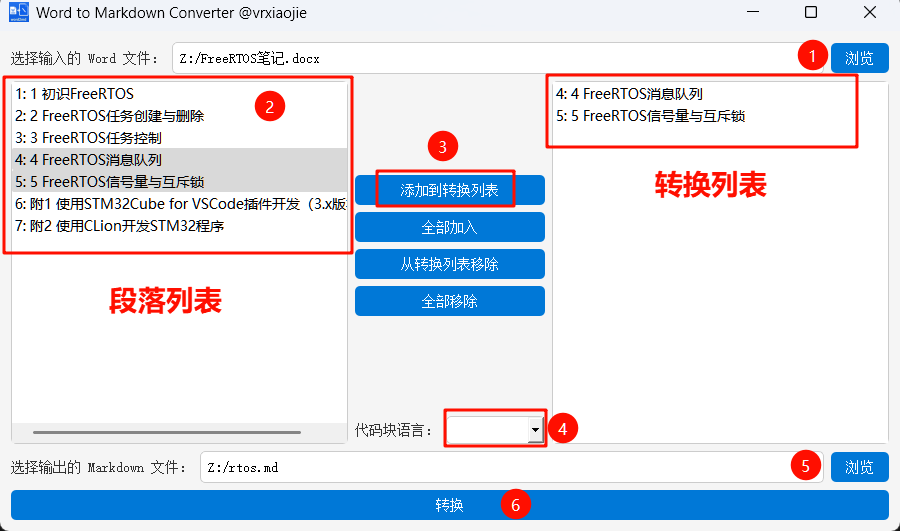

# 📝 word2md - 一键将 Word 转换为 Markdown！

🚀 **word2md** 是一个强大且易用的python工具，能够将 `.docx` 格式的 Word 文档转换为结构清晰、图片可视、格式友好的 **Markdown 文档**，非常适合技术文档、项目报告、博客发布等场景！

---

## ✨ 功能亮点

✅ **支持`GUI`和`命令行`两种方式使用**  
✅ **支持按段落选择性导出**  
✅ **自动提取并嵌入 Word 中的图片**（以 Markdown 格式引用）  
✅ **保留标题层级结构**（支持 Heading 1~3）  
✅ **自动识别并转换代码块**（可指定语言高亮）  
✅ **将 Word 中的纯 URL 链接转换为 Markdown 链接**  
✅ **导出图片并自动编号，在Markdown中自动引用**

---

## ❤️ 做这个工具的初衷

> 有时候，只是想把写好的 Word 文档转成 Markdown 发到博客或 GitHub 上，却还要一段段复制粘贴格式、调图片、改代码块？**用这个工具，一键搞定！**

---

💡 **如果你觉得这个项目有帮助，欢迎点个 Star ⭐️ 鼓励一下作者！**

---
# 📝 在开始之前...
如果你的文档中有代码或者有URL，请务必进行以下两个步骤
## 🛠️ 1. 调整word代码块样式

（1）请在你的word中新建一个名为`Code`的样式 **（注意大小写！）**

（2）将该样式保存，并应用到你word中的所有代码上

（3）**将每个代码段落的前后各空出一行的空间（重要！）**

## 🔗  2. 取消URL的超链接

（1）点击word的文件--选项--校对--自动更正选项--键入时自动套用格式--
**取消勾选**Internet及网络路径替换为超链接

（2）此时word中原有的网页超链接不会被自动取消掉，需要你一个个**手动取消超链接**。

---

# 🔧 使用方法1 可执行文件.exe运行
## 💾 1. 下载压缩包.zip
从[GitHub Releases页面](https://github.com/vrxiaojie/word2md/releases)下载最新的发布版本

文件在Assets中，通常以`word2md-版本号.zip`格式命名

## 📂 2. 解压文件并启动word2md.exe

（1）浏览本地文件夹，打开以.docx结尾的word文件

（2）程序自动以**大纲级别 1级**为划分依据，解析所有段落。请用鼠标点选要转换的段落列表。

（3）点击`添加到转换列表`按钮，转换列表中将显示将要被转换的段落。你也可以试一下其他三个按钮。

（4）设置word文档内的所有代码的语言，可以不设置本项。
如果该项不起作用，请参考[调整word代码块样式章节](#-3-调整word代码块样式可选)，检查是否配置正确。
**暂不支持给某代码块单独设置某个语言（或许以后会支持）。**

（5）浏览本地文件夹，存放转换后markdown文件

（6）点击转换按钮，Go🚀

## 🔍 3. 检查输出
在输出markdown文档的目录下存放有`images`目录，里面存有该段落所有图片。

# 🔧 使用方法2 命令行运行
## 💾 1. clone本仓库 
```shell
git clone https://github.com/vrxiaojie/word2md.git
```
## 📦 2. 安装python依赖 
**python版本>=3.8**

```shell
pip install -r requirements.txt
```

## ▶️ 3.在终端运行程序
```shell
python main.py -i InputFile.docx -o OutputFile.md [-l language]
```
**参数解释**

|参数|作用|备注|
|--|--|--|
|-i|输入doc文档名||
|-o|输出markdown文档名||
|-l|统一文档内的代码块语言|可选|

---
### 💡 示例1
输入文件为 `input.docx`，输出文件为`output.md`
```shell
python main.py -i input.docx -o output.md
```

### 💡 示例2
输入文件为 `input.docx`，输出文件为`output.md`，且统一文档内的代码块语言为 `C'
```shell
python main.py -i input.docx -o output.md -l c
```
---
在执行命令后，会提示输入要转换的段落范围，如下图所示


**⚠️注意：** 段落是以word文档中**大纲级别 1级**作为划分依据的
## 🔍 4. 检查输出
在输出markdown文档的目录下存放有`images`目录，里面存有该段落所有图片。

---
## 📜 License

本项目使用 [GPL3.0](LICENSE) 开源，欢迎自由使用、修改、分享！

---

# 🤝 如何贡献
非常欢迎你对仓库做出贡献！以下是参与贡献的方法：

## 🗂️ 提交Issue
- 如果你发现问题或者有功能建议，请到[Issue页面](https://github.com/vrxiaojie/word2md/issues)提交一个新的Issue。
- 提交Issue时，请尽量详细描述问题或建议。

## 🛠️ 提交Pull Request
1. Fork这个仓库到你的账号下。
2. Clone你的Fork的仓库到本地：  
   ```bash
   git clone https://github.com/你的用户名/word2md.git
   ```
3. 创建一个新分支：  
   ```bash
   git checkout -b feature/你的功能描述
   ```
4. 实现你的功能或修复问题，并提交代码：  
   ```bash
   git add .
   git commit -m "描述你的改动"
   ```
5. 推送到你的远程仓库：  
   ```bash
   git push origin feature/你的功能描述
   ```
6. 打开原始仓库，提交一个[Pull Request](https://github.com/vrxiaojie/word2md/pulls)。

## 👀 代码规范
- 请确保你的代码能够正常运行。
- 请尽量遵守代码风格，保持代码的可读性和一致性。

## 🙋‍♀️ 联系方式
如果你有任何疑问，可以通过[Discussions页面](https://github.com/vrxiaojie/word2md/discussions)一起交流。